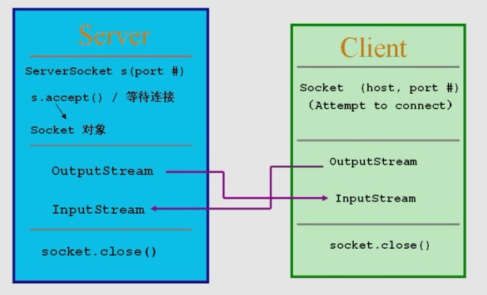

# LocalSocketTest

一个服务端与多个客户端使用LocalSocket/LocalServerSocket进行跨进程通信

[进入博客](https://github.com/)

您的Star是我进行创作的动力！

## 目录

1. [网络通信之Socket与LocalSocket的比较](https://www.cnblogs.com/joanna-yan/p/4708658.html) 2021-01-16

## 博客搬运工搬运内容

1. Socket与LocalSocket都可以实现网络通信，两个有什么区别呢？
   LocalSocket其通信方式与Socket差不多，只是LocalSocket没有跨越网络边界。
   于是，思考到一个问题：android应用与PC端的服务器应用进行通信时，能否用Socket、LocalSocke来实现？
   1.Socket肯定是能实现的。
   2.LocalSocket能实现吗？
   估计是不能，与PC端通信连接时，需要创建套接字实例，要传入参数主机名和端口号，而LocalSocket和LocalServerSocket都没有对应的api方法。
2. Java Socket
   socket最初用在基于TCP/IP网络间进程通信中，以C/S模式进行通信。实现异步操作，共享资源集中处理，提高客户端的响应能力。
   TCP通信基本流程：

   Server                                                                     Client
	1.创建socket                                                             1.创建socket

	2.bind()

	3.listen()

	4.accpet()

	-------等待客户端连接--------                                      2.connect()

	5.读数据(receive)　　　　　　　　　　　　　　　　　　　  3.写数据(send)

	6.写数据(send)　　　　　　　　　　　　　　　　　　　　  4.读数据(receive)

	7.关闭socket　　　　　　　　　　　　　　　　　　　　　  5.关闭socket

	数据流：
	

	二、Android LocalSocket

	LocalSocket

	在Unix域名空间创建一个套接字（非服务端）。是对Linux中Socket进行了封装，采用JNI方式调用，实现进程间通信。

	LocalServerSocket

	创建服务端Unix域套接字，与LocalSocket对应。

	客户端：

	LocalSocket客户端使用，创建套接字

	LocalSocketAddress 套接字地址，其实就是文件描述符（主要是服务器的地址，当然也可以客户端自个绑定地址）

	setSoTimeout设置超时

	connect客户端主动向服务端请求连接

	服务端：

	LocalServerSocket服务端使用，创建套接字同时指定文件描述符

	accept等待客户端连接（阻塞）

	共同：

	getInputStream获取套接字输入流

	getOutputStream获取套接字输出流

	close关闭套接字，客户服务都需要

## ❤️感谢大家

关注公众号「」，拉你进交流群，大家一起共同交流和进步。
